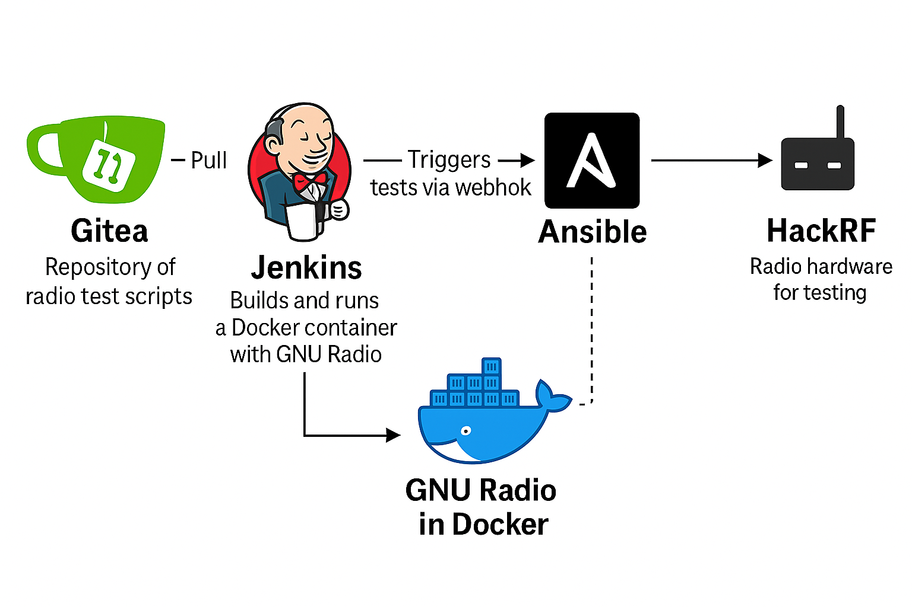

<div align="center">
  
  
  # 📡 RadioCICD
  
  ### *CI/CD Pipeline for Radio Frequency Testing*
  
  <p align="center">
    <em>DevOps meets RF Engineering</em><br>
    Complete containerized solution for automated RF testing
  </p>
  
  
  
  
</div>

---

## 🎯 **What is RadioCICD?**

RadioCICD is a **complete containerized CI/CD pipeline** for Radio Frequency testing automation. Deploy a full RF testing infrastructure in minutes using Docker containers - no complex installations required.

<div align="center">
  
</div>

---

## 🚀 **Key Features**

### 📦 **100% Containerized**
- **One-command deployment** - `docker-compose up -d`
- **No manual installations** - Everything runs in containers
- **Portable & reproducible** - Works anywhere Docker runs
- **Easy scaling** - Add more test nodes effortlessly

### 🔒 **On-Premise & Secure**
- **Gitea** - Self-hosted Git repository (no external dependencies)
- **Jenkins** - CI/CD orchestration with RF-specific pipelines
- **Semaphore** - Containerized Ansible for hardware deployment
- **GNU Radio** - Dockerized SDR environment with real-time monitoring

### ⚡ **Automated RF Testing**
- **Continuous Integration** - Automatic testing on every code commit
- **Hardware-in-the-loop** - Real RF hardware testing (HackRF, BladeRF, USRP)
- **Real-time monitoring** - Live signal analysis via GNU Radio GUI
- **Test reporting** - Automated results collection and analysis

---

## 🛠️ **Quick Start**

### Prerequisites
- Docker & Docker Compose
- RF Hardware (HackRF, BladeRF, or USRP)
- Linux host (Ubuntu 22.04+ recommended)

### Deploy in 3 Steps
```bash
# 1. Clone the repository
git clone https://github.com/yourname/RadioCICD.git
cd RadioCICD

# 2. Start all containers
docker-compose up -d

# 3. Access the services
# Gitea:     http://localhost:3000
# Jenkins:   http://localhost:8080  
# Semaphore: http://localhost:3001
```

### 📹 Configuration Tutorial
**Video tutorial coming soon!** Complete step-by-step setup guide for:
- Container configuration
- Pipeline setup
- RF hardware integration
- End-to-end testing workflow

---

## 🔄 **How It Works**

### **1. Code Management (Gitea)**
- Store RF test scripts and GNU Radio flowgraphs
- Host Docker images for custom test environments
- Manage Ansible playbooks for hardware deployment
- Trigger builds via webhooks

### **2. Continuous Integration (Jenkins)**
- **Build Stage** - Validate and build GNU Radio containers
- **Test Stage** - Run RF script validation and dry-run tests
- **Deploy Stage** - Push validated changes to Semaphore

### **3. Test Deployment (Semaphore)**
- Execute Ansible playbooks on RF hardware
- Deploy test containers to remote nodes
- Monitor deployment status via web UI

### **4. RF Testing Execution**
- GNU Radio containers perform actual RF tests
- Real-time signal monitoring and analysis
- Automated test result collection
- Integration with CI/CD feedback loop

---

## 💡 **Benefits**

### **For RF Engineers**
- 🔬 **Reproducible testing** - Consistent test environments
- 📊 **Real-time monitoring** - Live signal analysis during tests
- 🚀 **Faster development** - Continuous integration for RF projects
- 🛡️ **Quality assurance** - Automated validation before deployment

### **For DevOps Teams**
- 📦 **Easy deployment** - Everything containerized and automated
- 🔧 **Simple maintenance** - No complex software installations
- 📈 **Scalable** - Add more test hardware as needed
- 🔒 **Secure** - Complete on-premise solution

### **For Organizations**
- 💰 **Cost effective** - Efficient use of RF test equipment
- ⚡ **Faster time-to-market** - Automated testing reduces delays
- 📋 **Compliance ready** - Audit trails and test documentation
- 🛡️ **Risk reduction** - Catch issues before production

---

## 🧪 **Supported RF Hardware**

- **HackRF One** - 1 MHz to 6 GHz transceiver
- **BladeRF** - High-performance SDR platform  
- **USRP** - Universal Software Radio Peripheral
- **RTL-SDR** - Low-cost receive-only dongles
- **Custom hardware** - Extensible for any RF device

---

## 📁 **Project Structure**

```
RadioCICD/
├── docker-compose.yml          # All services definition
├── radiocicd-logo.png          # Project logo
├── radiocicd-architecture.png  # System architecture
├── setup.sh                    # Quick setup script
├── gitea/                      # Git repository config
├── jenkins/                    # CI/CD pipeline definitions  
├── Ansible/                    # Hardware deployment automation
└── infra_deploy/               # Infrastructure as code
```

---

## 🤝 **Contributing**

We welcome contributions in:
- 🔧 **RF Hardware Support** - Add new SDR devices
- 🧪 **Test Scripts** - GNU Radio flowgraphs and test cases
- 📊 **Monitoring** - Enhanced visualization and reporting
- 🐳 **Containers** - Optimized Docker images
- 📚 **Documentation** - Tutorials and examples

---

## 📄 **License**

This project is open source and available under the [MIT License](LICENSE).

---

<div align="center">
  <p><strong>Ready to revolutionize your RF testing? 🚀</strong></p>
  
  [](https://github.com/yourname/RadioCICD)
  [](https://hub.docker.com/r/radiocicd)
  [](https://docs.radiocicd.com)
  
  <sub>Built with 📡 and ❤️ for the RF Engineering Community</sub>
</div>
